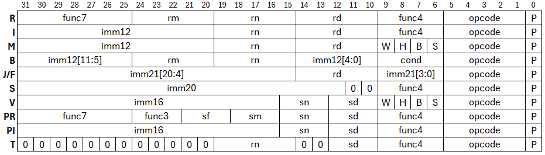

# Especificación del ISA

## ISA green sheet

- **Tipo**: Reduced Instruction Set Computer (RISC)
- **Clase**: registro-registro
- **Direccionamiento**: little-endian
- **Tipo de direccionamiento**: desplazamiento
- **Tamaño de palabra**: 32 bits
- **Tipos de datos**: enteros
- **Especificaciones**: criptografía, seguridad
- **Extensiones**: I (enteros), S(seguridad)
- **Arquitectura**: F32IS

-----

### Banco de registros

- **Cantidad**: 32 registros
- **Longitud de direccion**: 5 bits

|addr|nombre|descripcion|
|----|------|-----------|
|0   | <code>zero</code> | 0x0 (<i>read-only</i>) |
|1   | <code>ra</code>   | return address |
|2   | <code>sp</code>   | stack pointer |
|3   | <code>pc</code>   | program counter |
|4   | <code>lr</code>   | login register (<i>read-only</i>) |
|5   | <code>p0</code>   | argumento y retorno de funcion|
|6   | <code>p1</code>-<code>p8</code>   | argumentos de funcion |
|14  | <code>r0</code>-<code>r15</code>| proposito general |
|30  | <code>delta</code> | 0x9e3779b9 (<i>read-only</i>) |
|31  | <code>max</code>   | 0xFFFFFFFF (<i>read-only</i>) |

### Banco seguro de registros

- **Cantidad**: 8 registros
- **Longitud de direccion**: 3 bits

|addr|nombre|descripcion|
|----|------|-----------|
|0   |  <code>ax</code> | proposito general |
|1   |  <code>bx</code> | proposito general |
|2   |  <code>cx</code> | proposito general |
|3   |  <code>dx</code> | proposito general |
|4   |  <code>ex</code> | proposito general |
|5   |  <code>fx</code> | proposito general |
|6   |  <code>gx</code> | proposito general |
|7   |  <code>hx</code> | proposito general |

### Set de instrucciones

- Instrucciones para extension de enteros (I)

| tipo | instruccion | descripcion |
|------|-------------|-------------|
|**R**| <code>add rd, rn, rm</code> | $R[rd] \leftarrow R[rn] + R[rm]$ |
|**R**| <code>sub rd, rn, rm</code> | $R[rd] \leftarrow R[rn] - R[rm]$ |
|**R**| <code>mul rd, rn, rm</code> | $R[rd] \leftarrow R[rn] * R[rm]$ |
|**R**| <code>div rd, rn, rm</code> | $R[rd] \leftarrow R[rn]  \div R[rm]$ |
|**R**| <code>mod rd, rn, rm</code> | $R[rd] \leftarrow R[rn]\ \%\ R[rm]$ |
|**R**| <code>and rd, rn, rm</code> | $R[rd] \leftarrow R[rn]\ \& \ R[rm]$ |
|**R**| <code>orr rd, rn, rm</code> | $R[rd] \leftarrow R[rn]\ \|\ R[rm]$ |
|**R**| <code>xor rd, rn, rm</code> | $R[rd] \leftarrow R[rn]\ \^\ \ R[rm]$ |
|**R**| <code>sll rd, rn, rm</code> | $R[rd] \leftarrow R[rn] << R[rm]$ |
|**R**| <code>srl rd, rn, rm</code> | $R[rd] \leftarrow R[rn] >> R[rm]$ |
|**R**| <code>mov rd, rn </code> | $R[rd] \leftarrow R[rn]$ |
|**R**| <code>seq rd, rn, rm </code> | $R[rd] \leftarrow (R[rn] == R[rm])$ |
|**I**| <code>addi rd, rn, rm</code> | $R[rd] \leftarrow R[rn] + imm$ |
|**I**| <code>subi rd, rn, rm</code> | $R[rd] \leftarrow R[rn] - imm$ |
|**I**| <code>muli rd, rn, rm</code> | $R[rd] \leftarrow R[rn] * imm$ |
|**I**| <code>divi rd, rn, rm</code> | $R[rd] \leftarrow R[rn] \div imm$ |
|**I**| <code>modi rd, rn, rm</code> | $R[rd] \leftarrow R[rn]\ \%\ imm$ |
|**I**| <code>andi rd, rn, rm</code> | $R[rd] \leftarrow R[rn]\ \& \ imm$ |
|**I**| <code>orri rd, rn, rm</code> | $R[rd] \leftarrow R[rn]\ \|\ imm$ |
|**I**| <code>xori rd, rn, rm</code> | $R[rd] \leftarrow R[rn]\ \^\ \ imm$ |
|**I**| <code>slli rd, rn, rm</code> | $R[rd] \leftarrow R[rn] << imm$ |
|**I**| <code>srli rd, rn, rm</code> | $R[rd] \leftarrow R[rn] >> imm$ |
|**I**| <code>movi rd, imm </code> | $R[rd] \leftarrow imm$ |
|**I**| <code>seqi rd, rn, imm </code> | $R[rd] \leftarrow (R[rn] == imm)$ |
|**M**| <code>ldw rd, $\pm$imm(rn)</code> | $R[rd] \leftarrow M[R[rn] \pm imm]_{31:0}$ |
|**M**| <code>ldh rd, $\pm$imm(rn)</code> | $R[rd] \leftarrow M[R[rn] \pm imm]_{15:0}$ |
|**M**| <code>ldb rd, $\pm$imm(rn)</code> | $R[rd] \leftarrow M[R[rn] \pm imm]_{7:0}$ |
|**M**| <code>stw rd, $\pm$imm(rn)</code> | $R[rd]_{31:0} \rightarrow M[R[rn] \pm imm]$ |
|**M**| <code>sth rd, $\pm$imm(rn)</code> | $R[rd]_{15:0} \rightarrow M[R[rn] \pm imm]$ |
|**M**| <code>stb rd, $\pm$imm(rn)</code> | $R[rd]_{7:0} \rightarrow M[R[rn] \pm imm]$ |
|**B**| <code>beq rn, rm, imm </code> | if ($R[rn]==R[rm]$) $PC \leftarrow PC + (imm << 2)$ |
|**B**| <code>bne rn, rm, imm </code> | if ($R[rn]\ != R[rm]$) $PC \leftarrow PC + (imm << 2)$ |
|**B**| <code>bgt rn, rm, imm </code> | if ($R[rn]>R[rm]$) $PC  \leftarrow PC + (imm << 2)$ |
|**B**| <code>blt rn, rm, imm </code> | if ($R[rn]<R[rm]$) $PC \leftarrow PC + (imm << 2)$|
|**B**| <code>bge rn, rm, imm </code> | if ($R[rn]>=R[rm]$) $PC \leftarrow PC + (imm << 2)$ |
|**B**| <code>ble rn, rm, imm </code> | if ($R[rn]<=R[rm]$) $PC \leftarrow PC + (imm << 2)$|
|**J**| <code>jal rd, imm </code>| $R[rd] \leftarrow PC$; $PC \leftarrow PC+imm$ |
|**S**| <code>login imm </code>| $R[lr] \leftarrow (imm ==\ <password>)$ |
|**S**| <code>quit </code>| $R[lr] \leftarrow 0$ |

- Instrucciones para extension de seguridad (S)

| tipo | instruccion | descripcion |
|------|-------------|-------------|
|**V**| <code>ldvw sd, $\pm$imm(sn)</code> | $S[sd] \leftarrow V[S[sn] \pm imm]_{31:0}$ |
|**V**| <code>ldvh sd, $\pm$imm(sn)</code> | $S[sd] \leftarrow V[S[sn] \pm imm]_{15:0}$ |
|**V**| <code>ldvb sd, $\pm$imm(sn)</code> | $S[sd] \leftarrow V[S[sn] \pm imm]_{7:0}$ |
|**V**| <code>stvw sd, $\pm$imm(sn)</code> | $S[sd]_{31:0} \rightarrow V[S[sn] \pm imm]$ |
|**V**| <code>stvh sd, $\pm$imm(sn)</code> | $S[sd]_{15:0} \rightarrow V[S[sn] \pm imm]$ |
|**V**| <code>stvb sd, $\pm$imm(sn)</code> | $S[sd]_{7:0} \rightarrow V[S[sn] \pm imm]$ |
|**PR**| <code>padd sd, sn, sm</code> | $S[sd] \leftarrow S[sn] + S[sm]$ |
|**PR**| <code>psub sd, sn, sm</code> | $S[sd] \leftarrow S[sn] - S[sm]$ |
|**PR**| <code>pmul sd, sn, sm</code> | $S[sd] \leftarrow S[sn] * S[sm]$ |
|**PR**| <code>pdiv sd, sn, sm</code> | $S[sd] \leftarrow S[sn] \div S[sm]$ |
|**PR**| <code>pmod sd, sn, sm</code> | $S[sd] \leftarrow S[sn]\ \%\ S[sm]$ |
|**PR**| <code>pand sd, sn, sm</code> | $S[sd] \leftarrow S[sn]\ \& \ S[sm]$ |
|**PR**>| <code>porr sd, sn, sm</code> | $S[sd] \leftarrow S[sn]\ \|\ S[sm]$ |
|**PR**| <code>pxor sd, sn, sm</code> | $S[sd] \leftarrow S[sn]\ \^\ \ S[sm]$ |
|**PR**| <code>pseq sd, sn, sm</code> | $S[sd] \leftarrow (S[sn] == S[sm])$ |
|**PR**| <code>pmov sd, sn</code> | $S[sd] \leftarrow S[sn]$ |
|**PR**| <code>paddadd sd, sn, sm, sf</code> | $S[sd] \leftarrow (S[sn] + S[sm]) + S[sf]$ |
|**PR**| <code>pxorxor sd, sn, sm, sf</code> | $S[sd] \leftarrow (S[sn]\ \^\ \ S[sm])\ \^\ \ S[sf]$ |
|**PR**| <code>pslladd sd, sn, sm, sf</code> | $S[sd] \leftarrow (S[sn] << S[sm]) + S[sf]$ |
|**PR**| <code>psrladd sd, sn, sm, sf</code> | $S[sd] \leftarrow (S[sn] >> S[sm]) + S[sf]$ |
|**PI**| <code>paddi sd, sn, imm</code> | $S[sd] \leftarrow S[sn] + imm$ |
|**PI**| <code>psubi sd, sn, imm</code> | $S[sd] \leftarrow S[sn] - imm$ |
|**PI**| <code>pmuli sd, sn, imm</code> | $S[sd] \leftarrow S[sn] * imm$ |
|**PI**| <code>pdivi sd, sn, imm</code> | $S[sd] \leftarrow S[sn] \div imm$ |
|**PI**| <code>pmodi sd, sn, imm</code> | $S[sd] \leftarrow S[sn]\ \%\ imm$ |
|**PI**| <code>pandi sd, sn, imm</code> | $S[sd] \leftarrow S[sn]\ \& \ imm$ |
|**PI**| <code>porri sd, sn, imm</code> | $S[sd] \leftarrow S[sn]\ \|\ imm$ |
|**PI**| <code>pxori sd, sn, imm</code> | $S[sd] \leftarrow S[sn]\ \^\ \ imm$ |
|**PI**| <code>pseqi sd, sn, imm</code> | $S[sd] \leftarrow (S[sn] == imm)$ |
|**PI**| <code>pmovi sd, imm</code> | $S[sd] \leftarrow imm$ |
|**T**| <code>send sd, rn </code> | $S[sd] \leftarrow R[rn]$ |
|**T**| <code>recv sd, rn </code> | $S[sd] \rightarrow R[rn]$ |

- Pseudo instrucciones

| tipo | instruccion | descripcion | representación |
|------|-------------|-------------|----------------|
|**F**| <code>call imm</code>  | $R[ra] \leftarrow PC$; $PC \leftarrow PC+imm$ | <code>jal ra, imm</code> |
|**B**| <code>beqz rn, imm </code>  | if ($R[rn] == 0$) $PC \leftarrow PC + (imm << 2)$ | <code>beq rn, zero, imm</code> |
|**J**| <code>jmp imm</code>  | $R[zero] \leftarrow PC$; $PC \leftarrow PC+imm$ | <code>jal zero, imm</code> |
|**R**| <code>ret</code>  | $R[pc] \leftarrow R[ra]$ | <code>mov pc, ra</code> |
|**R**| <code>nop</code>  | $R[zero] \leftarrow R[zero] + R[zero]$ | <code>add zero, zero, zero</code> |
|**R**| <code>seqz rd, rn </code>  | $R[rd] \leftarrow (R[rn] == R[zero])$ | <code>seq rd, rn, zero</code> |
|**I**| <code>la rd, addr</code> | $R[rd] \leftarrow addr$ | <code>movi rd, addr</code> |
|**I**| <code>li rd, imm</code> | $R[rd], \leftarrow imm$ | <code>movi rd, imm</code> |
|**PI**| <code>pla sd, addr</code> | $S[sd] \leftarrow addr$ | <code>pmovi sd, addr</code> |
|**PI**| <code>pli sd, imm</code> | $S[sd], \leftarrow imm$ | <code>pmovi sd, imm</code> |

**NOTAS**:

- Las notaciones $R[...]$, $M[...]$, $S[...]$, $V[...]$ significan accesos a registros, memoria, registros seguros y boveda, respectivamente.
- En las instrucciones **J** y **B** el valor del inmediato representa la distancia de salto hacia una instruccion con un *label* (generalmente calculada por el compilador). Esta se calcula $imm = instr[j] - instr[i] $; donde $i$ representa el indice de la instruccion actual y $j$ representa el indice de la instruccion hacia donde se desea saltar.
- Las instrucciones de tipo **PR** permiten múltiples combinaciones para la selección de operaciones, para esto refierase a las tablas de encodificación para operaciones de ALU primaria y secundaria

**TIPOS DE INSTRUCCIONES**:

- Tipo **R**: operaciones aritemeticas y logicas registro-registro
- Tipo **I**: operaciones aritemeticas y logicas registro-inmediato
- Tipo **M**: operaciones de memoria
- Tipo **B**: operaciones de control de flujo
- Tipo **J**/**F**: operaciones de salto largo relativo al PC
- Tipo **S**: operaciones de sesion para inicio y cierre de sesion
- Tipo **V**: operaciones de boveda
- Tipo **PR**: operaciones aritemeticas y logicas sobre registros seguros
- Tipo **PI**: operaciones aritemeticas y logicas sobre registro seguro e inmediato
- Tipo **T**: operaciones de transporte

### Formato de encodificación de instrucciones



- **Tipo R**:

|  campo  |  bits  | descripción |
|---------|--------|-------------|
| P | 0 | bit de seguridad |
| opcode | 1-5 | código de instrucción |
| func4 | 6-9 | funcionalidad |
| rd | 10-14 | dir. registro 1|
| rn | 15-19 | dir. registro 2 |
| rm | 20-24 | dir. registro 3 |
| func7 | 25-31 | funcionalidad extra |

- **Tipo I**:

|  campo  |  bits  | descripción |
|---------|--------|-------------|
| P | 0 | bit de seguridad |
| opcode | 1-5 | código de instrucción |
| func4 | 6-9 | funcionalidad |
| rd | 10-14 | dir. registro 1|
| rn | 15-19 | dir. registro 2 |
| imm12 | 20-31 | inmediato de 12 bits |

- **Tipo M**:

|  campo  |  bits  | descripción |
|---------|--------|-------------|
| P | 0 | bit de seguridad |
| opcode | 1-5 | código de instrucción |
| S | 6 | seleción operación (0: suma, 1:resta) |
| B | 7 | movimiento de byte |
| H | 8 | movimiento de media palabra |
| W | 9 | movimiento de palabra |
| rd | 10-14 | dir. registro 1|
| rn | 15-19 | dir. registro 2 |
| imm12 | 20-31 | inmediato de 12 bits |

- **Tipo B**:

|  campo  |  bits  | descripción |
|---------|--------|-------------|
| P | 0 | bit de seguridad |
| opcode | 1-5 | código de instrucción |
| cond | 6-9 | condicion de salto |
| imm12[4:0] | 10-14 | inmediato de 12 bits |
| rn | 15-19 | dir. registro 2 |
| rm | 20-24 | dir. registro 3 |
| imm12[11:5] | 25-31 | inmediato de 21 bits |

- **Tipo J/F**:

|  campo  |  bits  | descripción |
|---------|--------|-------------|
| P | 0 | bit de seguridad |
| opcode | 1-5 | código de instrucción |
| imm21[3:0] | 6-9 | inmediato de 21 bits |
| rd | 10-14 | dir. registro 1 |
| imm21[20:4] | 15-31 | inmediato de 21 bits |

- **Tipo S**:

|  campo  |  bits  | descripción |
|---------|--------|-------------|
| P | 0 | bit de seguridad |
| opcode | 1-5 | código de instrucción |
| func4 | 6-9 | funcionalidad |
| imm20 | 12-31 | inmediato de 20 bits |

- **Tipo V**:

|  campo  |  bits  | descripción |
|---------|--------|-------------|
| P | 0 | bit de seguridad |
| opcode | 1-5 | código de instrucción |
| S | 6 | seleción operación (0: suma, 1:resta) |
| B | 7 | movimiento de byte |
| H | 8 | movimiento de media palabra |
| W | 9 | movimiento de palabra |
| sd | 10-12 | dir. registro 1|
| sn | 13-15 | dir. registro 2 |
| imm16 | 16-31 | inmediato de 16 bits |

- **Tipo PR**:

|  campo  |  bits  | descripción |
|---------|--------|-------------|
| P | 0 | bit de seguridad |
| opcode | 1-5 | código de instrucción |
| func4 | 6-9 | funcionalidad primaria |
| sd | 10-12 | dir. registro 1|
| sn | 13-15 | dir. registro 2 |
| sm | 16-18 | dir. registro 3 |
| sf | 19-21 | dir. registro 4 |
| func3 | 22-24 | funcionalidad secundaria |
| func7 | 25-31 | funcionalidad extra |

- **Tipo PI**:

|  campo  |  bits  | descripción |
|---------|--------|-------------|
| P | 0 | bit de seguridad |
| opcode | 1-5 | código de instrucción |
| func4 | 6-9 | funcionalidad primaria |
| sd | 10-12 | dir. registro 1|
| sn | 13-15 | dir. registro 2 |
| imm16 | 16-31 | inmediato de 16 bits |

- **Tipo T**:

|  campo  |  bits  | descripción |
|---------|--------|-------------|
| P | 0 | bit de seguridad |
| opcode | 1-5 | código de instrucción |
| func4 | 6-9 | funcionalidad |
| sd | 10-12 | dir. registro 1|
| rn | 15-19 | dir. registro 2 |

### Tablas de encodificación

- Especificación de tipos instrucciones

| opcode |  instrucciones  | tipo |
|--------|-----------------|------|
| 00000  |   `add`    |**R**|
| 00001  |   `addi`   |**I**|
| 00010  |   `padd`   |**PR**|
| 00011  |   `paddi`  |**PI**|
| 00100  |`ldw`,`ldh`,`ldb`|**M**|
| 00101  |`stw`,`sth`,`stb`|**M**|
| 00110  |`ldvw`,`ldvh`,`ldvb`|**V**|
| 00111  |`stvw`,`stvh`,`stvb`|**V**|
| 01000  |   `beq`   |**B**|
| 01001  |   `jal`   |**J**/**F**|
| 10000  |   `send`, `recv`   |**T**|
| 10001  |   `login`, `quit`  |**S**|

- Especificación de operación (para instrucciones **T** )

| func4 | operacion |
|-------|-----------|
| 0000  | `send` |
| 0001  | `recv` |

- Especificación de operación para ALU primaria (para instrucciones **R**, **I**, **PR**, **PI** )

| func4 | operacion |
|-------|-----------|
| 0000  | `SLL`(<<) |
| 0001  | `SRL`(>>) |
| 0010  | `ADD`(+)  |
| 0011  | `SUB`(-)  |
| 0100  | `MUL`(*)  |
| 0101  | `DIV`(/)  |
| 0110  | `MOD`(%)  |
| 0111  | `AND`(&)  |
| 1000  | `OR` (\|) |
| 1001  | `XOR`(\^) |
| 1010  | `SEQ`     |

- Especificación de operación para ALU secundaria (para instrucciones **PR**)

| func3 | operacion |
|-------|-----------|
|  000  | `ADD`(+)  |
|  001  | `XOR`(\^) |

- Especificacion de condición de salto (para instrucciones **B**)

| cond  | comparacion |
|-------|-------------|
| 0000  | `BEQ`($==$) |
| 0001  | `BNE`($!=$) |
| 0010  | `BGT`($>$)  |
| 0011  | `BLT`($<$)  |
| 0100  | `BGE`($>=$) |
| 0101  | `BLE`($<=$) |

### Convención de para definicion de funciones
Para definir y hacer llamadas a funciones en programas de ensamblador, se deben utilizar llamadas a funciones utilizando `call`, además cada función debe cumplir con la convención de uso y guardado de registros para garantizar la integridad de los datos entre llamadas. Para este efecto se manipula el stack para almacenar registros en memoria al inicio de una llamada y restaurarlos al finalizar la función. El convenio de registros establecido asigna los registros `p0-p8` para argumentos y retorno de funciones, `r0-r15` para uso general, `ra` para direcciones de retorno y `sp` para puntero del stack en memoria.

```asm
__init__:
    movi r1, 4
    movi p0, 7
    add  p1, p0, r1
    call sum
    mul r1, p0, r1

// sum(a,b) => p0:a, p1:b, p0:a*2+b
sum:
    addi sp, sp, 8
    stw ra, 0(sp)
    stw r1, 4(sp)

    li r1, 2
    mul r1, p0, r1
    add p0, r1, p1 

    ldw r1, 4(sp)
    ldw ra, 0(sp)
    addi sp, sp, -8
    ret
```

Notese que únicamente se están guardando y restaurando los registros de proposito general requeridos para función.

### Convención de instrucciones en modo administrador
Para poder acceder al hardware de seguridad se necesita de iniciar sesion, para este efecto se invocar la instrucción `login` e ingresar una contraseña de 5 caracteres hexadecimales. En caso de haber ingresado la contraseña correcta el hardware de seguridad se habilita. Instrucciones del tipo **PR**,**PI**,**V** y **T** requiren de haber iniciado sesión. Del mismo modo, instrucciones seguidas por el símbolo `@` solo se ejecutan si el hardware seguro se encuentra habilitado. Al finalizar el uso del hardware de seguridad se debe cerrar sesión utilizando `quit`. El estado de sesión se puede encontrar en el registro `lr`. Por ejemplo vea el siguiente código:

```asm
1   addi r1, r0, 4 
2   login 0xBEEF0   # Inicio de sesion
3   li r2, 100
4   @mul r3, r1, r2
5   send ax, r0
6   send bx, r3
7   paddi cx, ax, 1
8   @psub dx, bx, cx
9   quit            # Cierre de sesion
10  recv dx, r4     # esta instruccion nunca va a ejecutarse
```

En caso de haber cerrado sesion, el hardware tiene un limite de ciclos despues de el cuál el hardware de seguridad es deshabilitado.